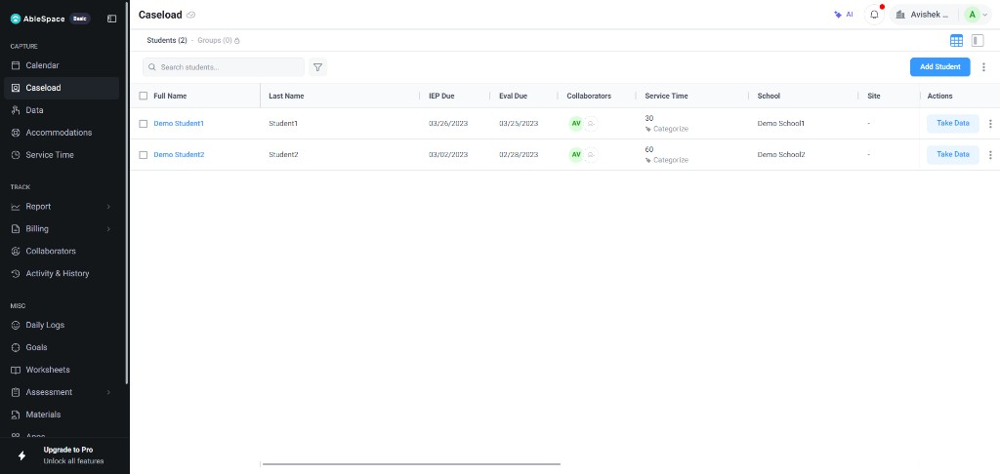
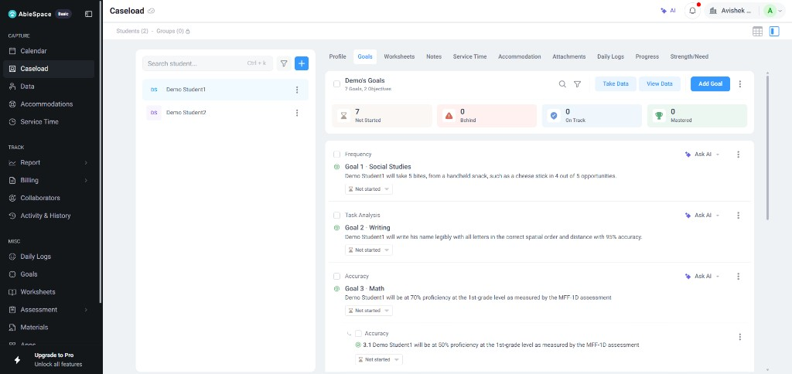
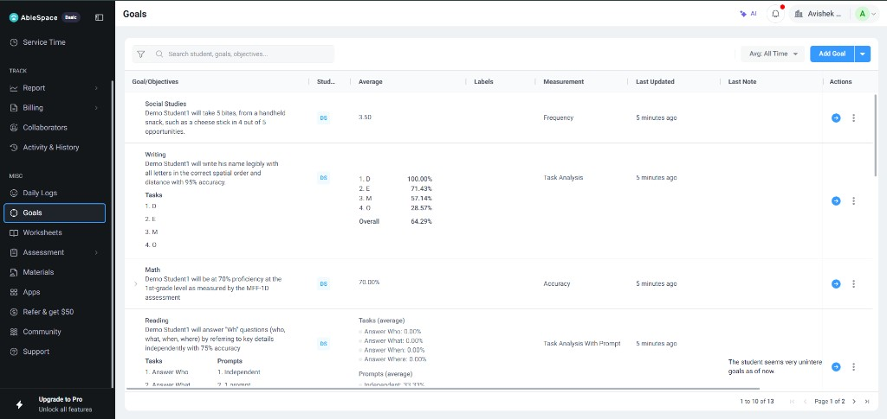
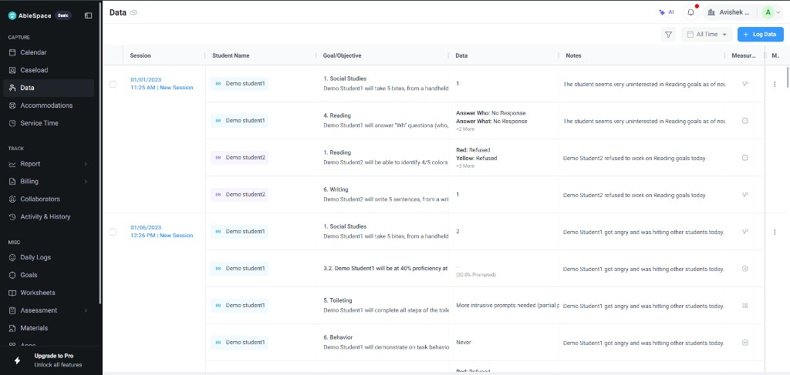
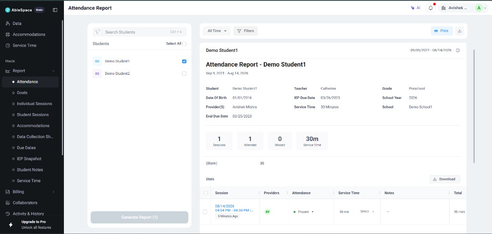

# Part 2 — AbleSpace Caseload & Take Data

**Candidate notes on AbleSpace’s data-collection workflow**  
Product explored: [ablespace.io](https://www.ablespace.io) · [Features](https://www.ablespace.io/features) · [Data types](https://www.ablespace.io/features/data-types) · [Tutorials](https://www.ablespace.io/tutorials)

I treated this like a product review for a tool I might ship myself: start from the job a school-based clinician actually has between bell schedules, then walk Caseload → student → Take Data / Data tab → what happens after the session ends. Below is that walkthrough in my own words, plus the gaps I would fix first.

---

## What I think AbleSpace is optimizing for

A speech therapist, OT, PT, special educator, or para on AbleSpace is not “entering records.” They are trying to answer, during a messy 20–30 minute pull-out:

> Did this student make progress on the IEP goal we are working on today, and can I prove it later without rewriting everything on Sunday night?

Caseload is the entry point because the work is organized around **students they own**, not around empty forms. From there, Take Data (and the faster Data tab) is where trials get logged against goals. AbleSpace’s bet is that if logging a trial is literally one click, people will do it live instead of on sticky notes — and the same clicks can feed graphs, session reports, service-minute tracking, and Medicaid billing notes without a second pass of typing.

That is a strong product thesis. The rest of this note is about how that thesis shows up in the Caseload / Take Data path, and where the UI still asks clinicians to do mental work the product could do for them.

---

## The workflow, as I understand it

### 1. Open Caseload

Caseload is my working roster. It is not a district-wide student search; it is “who am I responsible for.” That distinction matters. Between periods, a clinician’s question is usually:

- Who am I seeing next?
- Have I already taken data on them this week?
- Can I jump straight into logging without configuring anything?

*Screenshot 1 — Caseload → Students. Demo Student1 / Demo Student2 with IEP due, eval due, collaborators, service time, school, and a blue **Take Data** button on every row. This is the real starting point of the workflow.*

What stands out in the live UI:

- Caseload sits under **CAPTURE** next to Calendar, Data, Accommodations, and Service Time — data collection is framed as the daily job, not a report.
- Each row already exposes **Take Data**, so I do not have to dig into a student just to start logging.
- Service time is visible on the list (`30`, `60`, plus **Categorize**). Minutes are treated as first-class, not an afterthought.
- Search, filters, list/grid toggle, and **Add Student** are all on this one screen.

AbleSpace also lets you download/print the caseload and bulk-add students, which tells me they expect real district volumes. Collaboration (sharing students with paras/assistants) sits on this same list — Caseload is the shared spine of the product.

### 2. Open a student and look at goals before you tap anything

Before Take Data is useful, the student needs goals, and each goal needs a **data type**. This is not a small setup detail — it is the product’s core modeling choice.

*Screenshot 2 — Caseload → Demo Student1 → Goals. Split view: student list on the left, Goals tab on the right with status chips (Not Started / Behind / On Track / Mastered), **Take Data**, **View Data**, and **+ Add Goal**. Goal cards show title, description, status dropdown, Ask AI, and nested objectives (e.g. 3.1).*

What stands out here:

- Opening a student keeps Caseload context (left rail) while the right pane switches tabs: Profile, **Goals**, Worksheets, Notes, Service Time, Accommodation, Attachments, Daily Logs, Progress, Strength/Need.
- Goal health is summarized up top before I read any card — I can see the caseload is still “Not Started” for this demo student.
- Each goal is a card I can act on: take data for this student, view existing data, or add another goal.
- Nested objectives (Goal 3 → 3.1) show the model is goal → objective, not a flat checklist.

AbleSpace supports different measurement shapes on purpose, including:

| Data type | What the clinician is actually recording |
| --- | --- |
| Accuracy | Correct vs incorrect → percentage (e.g. /r/ production in words) |
| Frequency | Count of something happening (hand raises, peer greetings, AAC requests) |
| Opportunity | Total / correct / incorrect in a set of chances |
| Prompting Levels | How much help was needed (or MCQ-style levels) |
| Task Analysis / Task with Prompts | Steps of a routine, optionally with prompt level per step |
| Duration | How long a behavior or skill lasted |
| Rating Scale | Position on a defined scale |
| Anecdotal | Qualitative note when a number would lie |
| Custom | Mix numbers, text, checkboxes, calculated fields |

*Screenshot 3 — Goals (MISC). One list shows Measurement = Frequency, Task Analysis, Accuracy, Task Analysis With Prompt, with averages like `3.50` and `70.00%`. This is proof the product does not force every IEP goal into a single number field.*

Example from the live demo: Demo Student1 has Social Studies tracked as **Frequency** (average 3.50), Reading tracked as **Accuracy** (70%), and Task Analysis goals with per-step percentages. Those UIs cannot be identical. AbleSpace’s Take Data / Log Data flows have to reshape per goal, or later graphs lie.

If goals are missing or the wrong type is chosen, Take Data becomes a dead end. The tutorials (“How to add a Goal?”, “How to take data…”) exist because this setup step is easy to get wrong the first week.

### 3. Take Data during (or right after) the session

This is the screen the assignment asks about.

In plain language, the loop is:

1. I am with the student (or I just walked them back to class).
2. I open Take Data from Caseload / the student (or jump to **Data** → **+ Log Data**).
3. I see that student’s goals.
4. For each goal I work on, I log trials the way the data type expects — tap correct/incorrect for Accuracy, bump a counter for Frequency, run a timer for Duration, pick a prompt level, check off task-analysis steps, or type a short anecdotal note.
5. I move to the next goal without leaving the flow.
6. The session is saved against the student, the goal, and the time I was with them.

*Screenshot 4 — CAPTURE → Data. Sessions dated `01/01/2023`, rows for Demo Student1 / Demo Student2, Goal/Objective text, Data values (`1`, `Answer Who: No Response`, `Red: Refused`), and clinician Notes. **+ Log Data** is the fast path when you are not starting from Caseload.*

What this screen made concrete for me:

- Data is grouped by **Session** (date + time), then by student and goal — not a flat spreadsheet of anonymous rows.
- Mixed result shapes sit in one table: a count (`1`), a prompt/MCQ answer (`Answer Who: No Response`), a color/refusal state (`Red: Refused`). That matches the multi–data-type model.
- Notes live next to the trial (“The student seems very uninterested in Reading goals as of now”) so qualitative context is not lost in a separate app.
- Filters and **All Time** date range acknowledge catch-up and review, not only live tapping.

Two product details that stood out as honest about school life:

- The **Data** tab is the “I have 40 seconds between kids” path (tutorial: “How to log your data quickly using Data tab?”).
- You can enter / review data on **past sessions**. Therapists do not always get to tap during the activity. Catch-up is Tuesday afternoon, not an edge case.

AbleSpace also tracks **service time at session level and at goal level** while this is happening. That is important. Medicaid and district compliance often care as much about minutes served as about % correct. If time tracking were a separate form after Take Data, people would skip it. Bundling it into the same visit is the right call.

### 4. What the data becomes after you leave the screen

If Take Data only stored numbers, clinicians would still open Excel later. AbleSpace’s payoff is that the same trials become:

- Progress graphs (they advertise 20+ auto-built graph options)
- Pre-built reports for IEP meetings
- Service-time / attendance reports
- Medicaid billing notes meant to be copied and pasted, not rewritten

*Screenshot 5 — TRACK → Report → Attendance. Demo Student1 selected, date range All Time, summary cards (1 Sessions / 1 Attended / 0 Missed / 30m Service Time), and a Stats table with Present + 30 min. This is the payoff after capture: minutes and attendance without rebuilding a spreadsheet.*

That closed loop is why one-click collection can stick. The click has to buy back weekend paperwork, or paper wins.

---

## What I think they got right

**Students first, not forms first.** Starting on Caseload matches how people talk about their day (“I have Maya at 10:15”), not how databases are structured.

**Data types are treated as real domain objects.** Over 10 types looks like feature sprawl until you remember IEP goals are written that way in legal documents. A single numeric field would force therapists to invent private coding systems, and then graphs would lie at the IEP meeting.

**Speed is the product.** “Collect data with a single click” and mobile/iPad support are not marketing fluff. If the UI is slower than a clipboard tally, it will not be used mid-session. Period.

**They admit the workflow is messy.** Past sessions, Data tab, bulk add, rotating schedules, and para sharing all say: school days interrupt you; the tool should still accept the data later without shame.

**Downstream automation is the retention loop.** Graphs, reports, and billing notes are why the tap is worth doing. AbleSpace is selling “never rebuild this in Google Sheets before the meeting.”

---

## Improvements I would push (specific, not generic)

I did not treat these as “nice polish.” These are the places I would expect a clinician to get stuck or lose trust.

### 1. Caseload should answer “who still needs data today?” without opening anyone

A long Caseload is a wall of names. Between sessions I do not want to open each student to remember if I logged them. I would put a small, text-backed status on every row, for example:

- **Logged today**
- **Due this week**
- **Overdue**
- **Absent / no session**

Color alone is not enough in a fluorescent hallway on a phone. Text + icon. Sort / filter by “needs data” should be one tap from the Caseload header.

### 2. Take Data needs a sticky “session strip”

While logging, I am holding materials or an AAC device. I should always see, pinned at the top:

- Student name (so I never log on the wrong kid after a switch)
- Running service minutes
- “Goals logged this session: 2 / 6”
- A large **Next goal** control sized for a thumb

Right now the mental model is student → goal list → trials. That is correct structurally, but mid-session the UI should feel more like a stopwatch + checklist than like a form browser.

### 3. Never wait on the network for the next trial

School Wi‑Fi drops in basements and temporary classrooms. If a correct/incorrect tap spins or fails, the therapist goes back to paper and may not return. Trials should write to a local queue first (“Saved on device — syncing…”), and the next tap must stay instant. Sync conflicts can be resolved later; blocking the session cannot.

### 4. Order goals by what this session actually needs

AbleSpace already has rotating schedules and calendar sessions. Take Data should inherit that: put today’s scheduled goals first, then goals with no data this week, then everything else. A static full goal list forces the clinician to scroll past goals they are not probing today, which is exactly when mis-taps happen.

### 5. One-click needs one-tap Undo

Speed without recovery is dangerous. After every trial I want a quiet toast:

> Logged correct on Goal 3 (/s/ initial) — **Undo**

Also: confirm when switching students mid-session, and let me move a mistaken trial to another goal without deleting history. Paras especially will hit the wrong control under time pressure.

### 6. Keep complex data types from breaking the fast path

Accuracy and Frequency can stay as big hit targets. Prompting, Task Analysis, and Anecdotal are slower by nature. I would not rebuild the whole page for those. Keep the same goal list rhythm; open a compact sheet for prompt level / steps / note only when that goal needs it. Context switching costs more than an extra panel.

### 7. Show a tiny progress sparkline on Take Data itself

After a few trials, show “this session vs last 4 sessions” next to the goal. Clinicians decide *in the room* whether to probe more. Sending them to a Reports tab after the student has left is too late for that decision, even if the full graphs are excellent later.

### 8. Warn about thin service minutes before the session is closed

If I logged beautiful Accuracy data but only 12 service minutes on a session that is usually billed longer, nudge me before I leave:

> Service time is 12 minutes. Add a note or adjust time before closing?

Not a hard block — a compliance heads-up. Billing anxiety is real; silent short sessions create cleanup work later, which is what AbleSpace claims to remove.

### 9. Teach the setup path inside the empty state

New users can add a student, open Take Data, and hit a wall because no goal / no data type exists yet. Tutorials help, but the empty state should be a checklist on the screen itself:

1. Add student  
2. Add at least one goal  
3. Pick the data type that matches the IEP wording  
4. Take the first trial  

First-run success is a product feature, not a help-center article.

---

## Bottom line

AbleSpace’s Caseload → Take Data path is built around the right object (the student), the right atomic action (one trial), and the right payoff (graphs, reports, minutes, billing without re-entry). The places I would invest next are not “more features” — they are **situational awareness on Caseload**, **session continuity on Take Data**, **offline trust**, and **recovery from fast mistakes**. Those are the differences between a tool therapists admire in a demo and a tool they still open when the hallway is loud and they have four minutes left.

---

## Screenshots

| # | File | What it shows | Status |
| --- | --- | --- | --- |
| 1 | `screenshots/01-caseload-students.png` | Caseload Students table + Take Data | Added |
| 2 | `screenshots/02-student-goals.png` | Student Goals tab with goal cards | Added |
| 3 | `screenshots/04-goals-measurements.png` | Goals list with Frequency / Accuracy / Task Analysis | Added |
| 4 | `screenshots/03-data-tab-logged.png` | Data tab — logged sessions, values, notes | Added |
| 5 | `screenshots/05-attendance-report.png` | Attendance report + service minutes | Added |

Sources used while writing this: live AbleSpace session (screenshots above), product/features pages, data-types reference, tutorial index (Take Data, Data tab, past sessions, caseload), and AbleSpace’s writing on caseload management and IEP progress monitoring.
